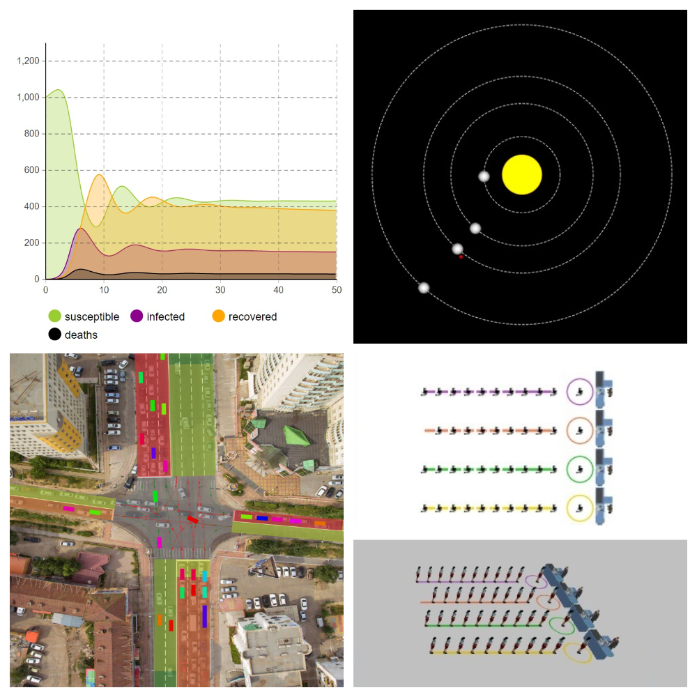
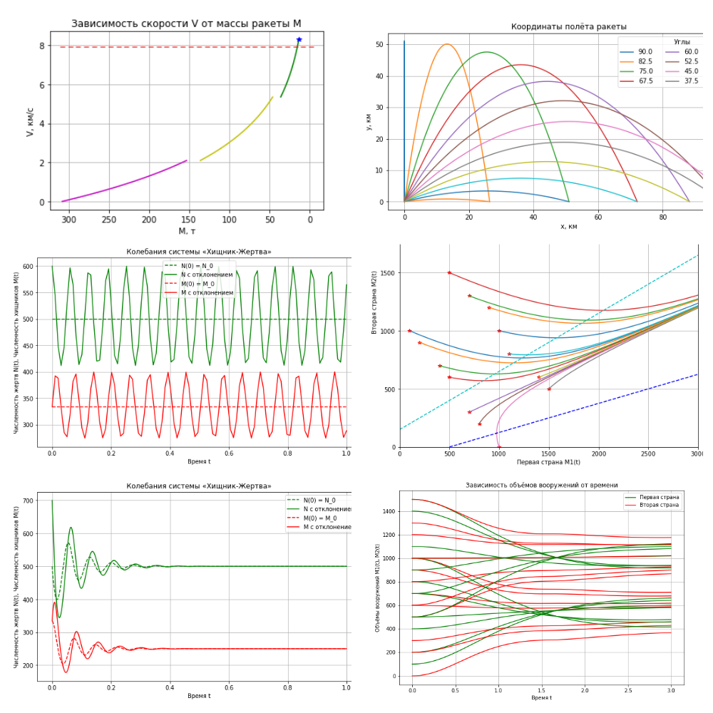

# Implementing a few popular models
Modeling using simulation tool (Java, AnyLogic 8.8.0): 
- Forecasting product sales;
- Epidemic spread model;
- Urban population dynamics;
- Planetary movement;
- Road traffic;
- Queuing systems.

Realization of several mathematical models (Python 3, Jupyter Notebook):
- Measuring Bullet Velocity;
- Rocket Science Problems;
- Ballistic Missile Defense;
- Ordinary Differential Equation (ODE);
- Predator-Prey;
- Arms Race.

