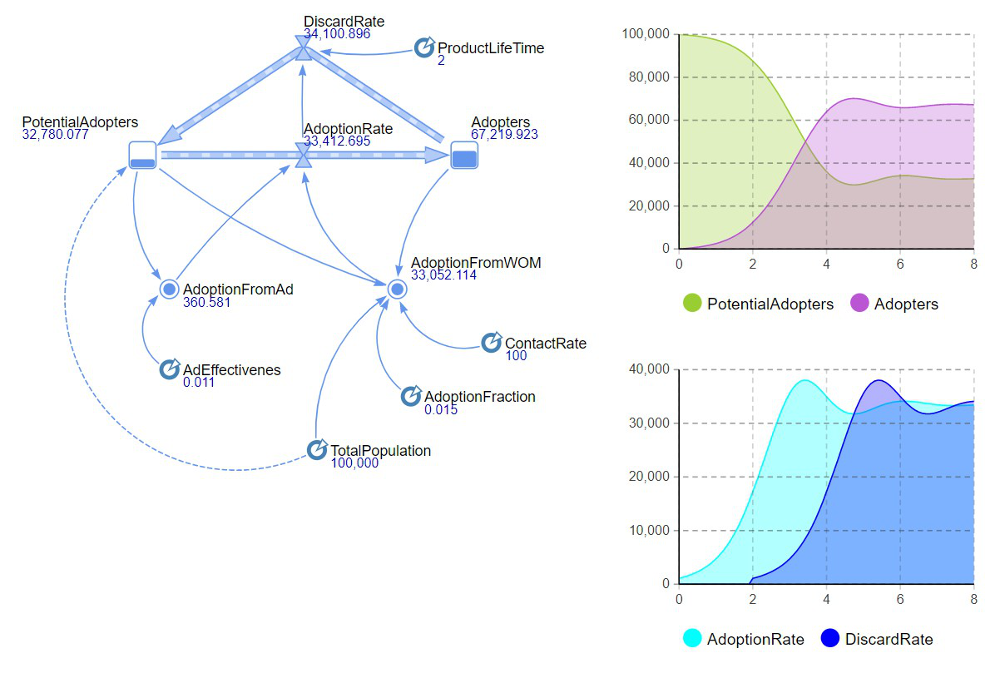
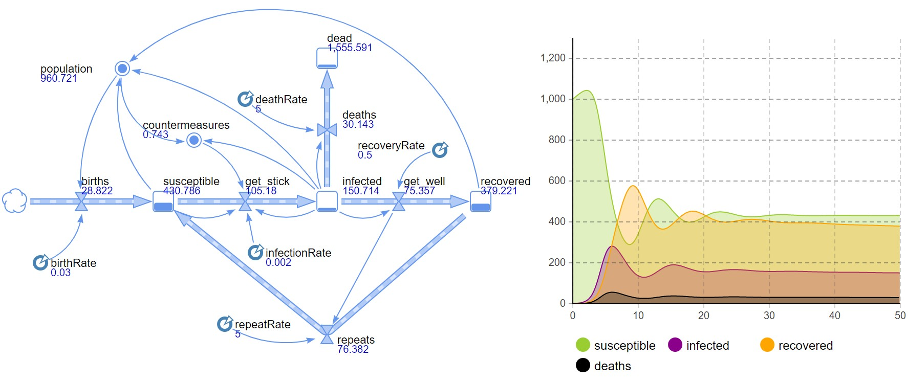
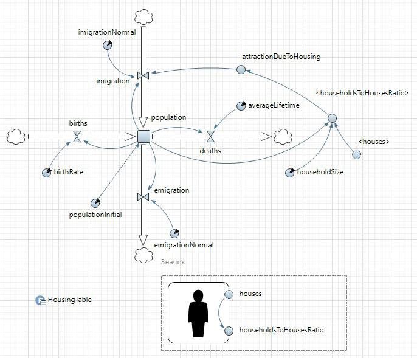
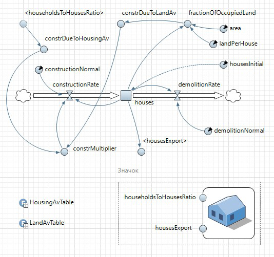
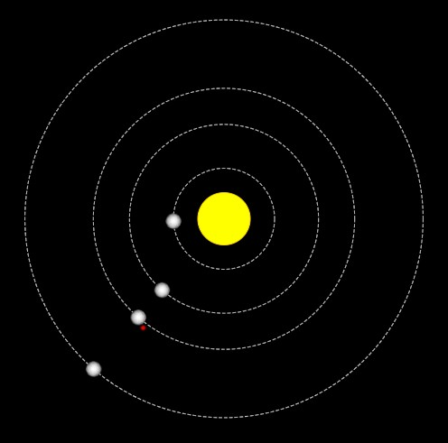
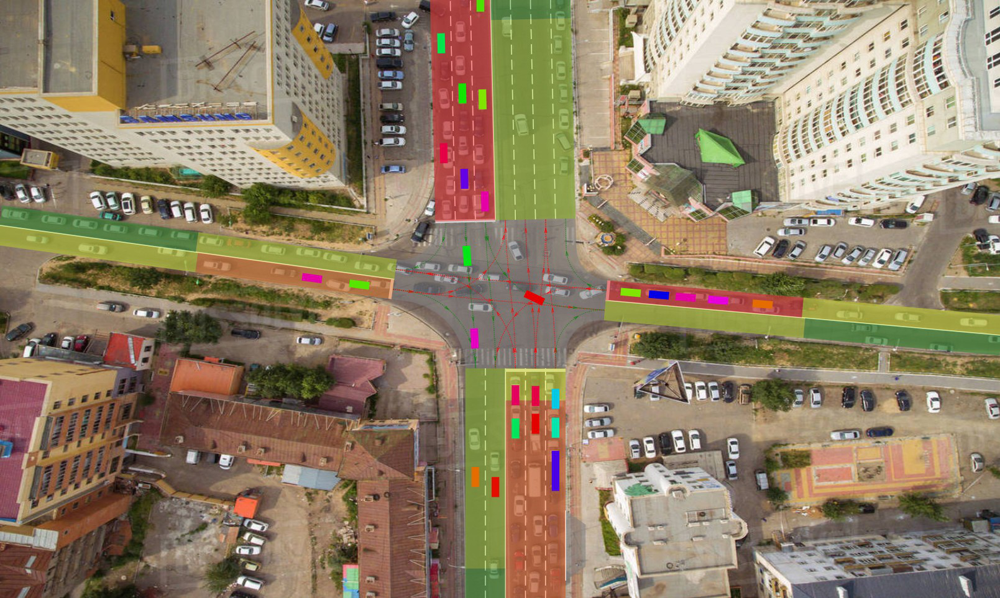

# Modeling using simulation tool Anylogic 
## 1. Forecasting product sales with a stochastic Bass model
Моделирование процесса реализации продукции по Бассу с учетом того, что купленный потребителем продукт со временем приходит в негодность и потребитель покупает новый продукт на его замену.  

| Накопители | Описание | 
|----------|----------|
| PotentialAdopters| потенциальные потребители продукции| 
| Adopters| потребители, которые уже купили продукт| 

| Потоки | Описание |
|----------|----------|
| AdoptionRate| поток, моделирующий процесс потребления|
| DiscardRate| поток, отражающий повторные покупки|

| Переменные | Описание |
|----------|----------|
| AdoptionFromAd| число потребителей продукта, которые его приобрели под влиянием рекламы|
| AdoptionFromWOM| число потребителей продукта, которые его приобрели под влиянием общения с потребителями, которые уже купили продукт|

| Параметры | Описание |
|----------|----------|
| TotalPopulation| численность населения|
| ContactRate| число контактов|
| AdEffectivenes| эффективность рекламы|
| AdoptionFraction| сила убеждения|
| ProductLifeTime| время годности продукта|

## 2. Epidemic spread model
Модель, отражающая тенденции распространения эпидемии.

| Накопители | Описание | 
|----------|----------|
| susceptible| не заболевшие|
| infected| инфицированные|
| recovered| выздоровевшие|
| dead| умершие|

| Потоки | Описание |
|----------|----------|
| get_stick| интенсивность протекания заболевания|
| get_well| интенсивность выздоровления|
| repeats| интенсивность повторного заболевания|
| births| естественный прирост населения|
| deaths| смертность|

| Переменные | Описание |
|----------|----------|
| population| численность населения|
| countermeasures| меры противодействия развитию эпидемии|

| Параметры | Описание |
|----------|----------| 
| infection_rate| фактор, влияющий на процесс заболевания|
| recovery_rate| фактор, влияющий на процесс выздоровления|
| repeatRate| фактор, влияющий на процесс повторного заболевания|
| birthRate| коэффициент естественного прироста населения|
| deathRate| коэффициент смертности|

## 3. Model of urban population dynamics
Модель изменения динамики численности городского населения на базе двух взаимодействующих активных классов. Данная модель учитывает динамику роста населения в зависимости от жилищных условий. Активный класс populationSector (сектор населения) моделирует динамку роста численности населения, а класс housingSector (жилищный сектор) динамику роста жилья.

### Активный класс сектора населения (populationSector)
| Накопители | Описание | 
|----------|----------|
| population| численность населения|

| Потоки | Описание |
|----------|----------|
| births| уровень рождаемости|
| imigration| уровень иммиграции (въезд в страну)|
| deaths| уровень смертности|
| emigration| уровень эмиграции (выезд из страны)|

| Переменные | Описание |
|----------|----------|
| houses| число домов, которые построены в городе|
| householdToHousesRatio| заселенность города|
| attractionDueToHousing| спрос на жилье|

| Параметры | Описание |
|----------|----------| 
| populationInitial| начальная численность населения|
| birthRate| уровень рождаемости|
| imigrationNormal| коэффициент миграции|
| averageLifetime| средняя продолжительность жизни|
| emigrationNormal| доля эмиграции|
| householdSize| среднее количество человек в составе семьи|

### Активный класс сектора жилищного строительства (housingSector)
| Накопители | Описание | 
|----------|----------|
| houses| число домов, которые построены в городе|

| Потоки | Описание |
|----------|----------|
| constructionRate| скорость строительства|
| demolitionRate| скорость сноса|

| Переменные | Описание |
|----------|----------|
| constrMultiplier| интенсивность строительства|
| constrDueToHousingAv| реальная потребность в строительстве|
| constrDueToLandAv| земельные участки, имеющиеся для строительства|
| fractionOfOccupiedLand| доля использованной под застройку земли|
| housesExport| число возведенных домов|
| householdsToHousesRatio| заселенность города|

| Параметры | Описание |
|----------|----------| 
| constructionNormal| Норма возведения нового жилья|
| landPerHouse| Доля городской земли на строение|
| area| Городская площадь|
| housesInitial| Начальное число домов в городе|
| demolitionNormal| Норма сноса ветхого жилья|

### Модель динамики численности населения

## 4. Planetary movement
Задание движения некоторых планет и спутника относительно Солнца по заданному маршруту.

| Планета | Меркурий | Венера | Земля | Луна | Марс |
|----------|----------|----------|----------|----------|----------| 
| Расстояние от Солнца в афелии| 69,82| 108,94| 152,1| 152.1| 249,2|
| Сидерический период, лет| 0,241| 0,615| 1| 0.075| 1,88|
| Большая полуось, млн.км| 57,91| 108,21| 149,60| 13| 227,94|
| Эксцентриситет| 0,206| 0,007| 0,017| 0.055| 0,093|

## 5. Road traffic
Воспроизведение существующего участка дороги с использованием функционала дорог, перекрестков и светафоров. Текущий сигнал светафора (зеленый, желтый, красный) отображается цветом поворотных стрелок. Загруженность полос также отображается цветом. На дорожной карте реализован механизм автобусной остановки. 

## 6. Queuing systems
Модель системы массового обслуживания (СМО), включающая обслуживание людей автоматами и несколькими кассирами. Порядок поступления реализован в соответствии с действительным положением вещей, с двумя пиками: в районе 13:00 и 18:00. Порядок распределения заявок по исполнителям: четыре автомата, очередь к которым представляет общую область, и четыре кассира с индивидуальными очередями. 

